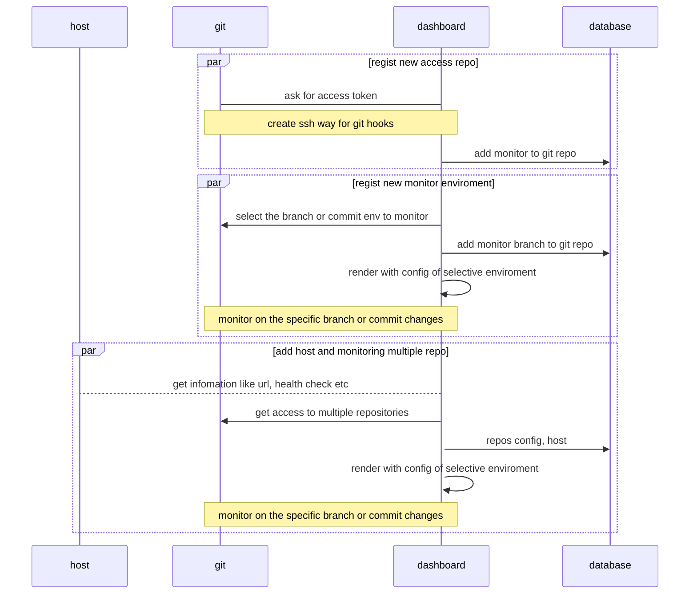

# project_dashboard

## expect output

## briefly diagram flow

```mermaid
sequenceDiagram
    participant host
    participant git
    participant dashboard
    participant database
    par regist new access repo
        dashboard->git: ask for access token
        Note over dashboard,git: create ssh way for git hooks
        dashboard->>database: add monitor to git repo
    end
    par regist new monitor enviroment
        dashboard->>git: select the branch or commit env to monitor
        dashboard->>database: add monitor branch to git repo
        dashboard->>dashboard: render with config of selective enviroment
        Note over dashboard,git: monitor on the specific branch or commit changes
    end
    par add host and monitoring multiple repo
        dashboard-->host: get infomation like url, health check etc
        dashboard->>git: get access to multiple repositories
        activate dashboard
        dashboard->>database: repos config, host
        dashboard->>dashboard: render with config of selective enviroment
        Note over dashboard,git: monitor on the specific branch or commit changes
    end
```
